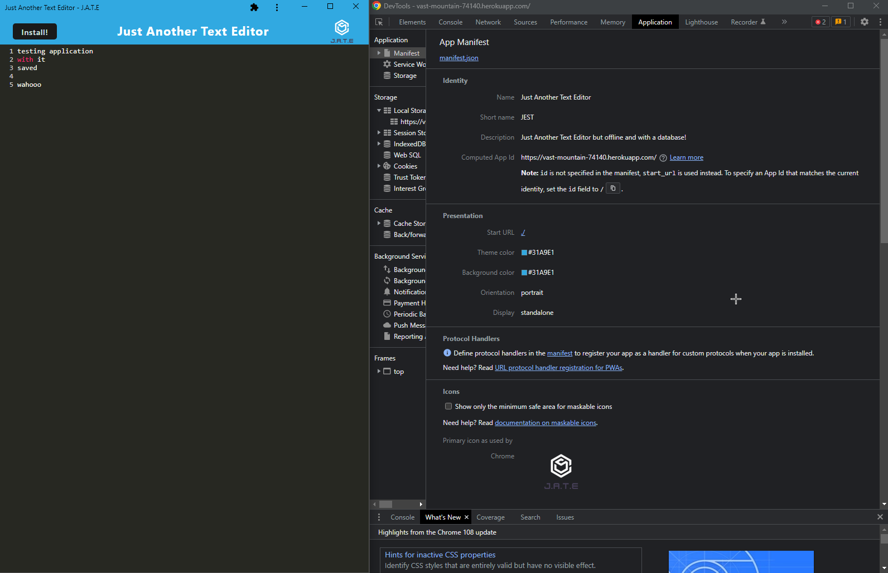

# pwa-text-editor

## Description

This site allows for the user to use an online and offline text editor to save notes that they can make use of later. It makes use of [webpacks](https://webpack.js.org/) and plugins to create a more optimized site. The site is able to be installed by using the [webpack pwa manifest](https://www.npmjs.com/package/webpack-pwa-manifest) plugin to automatically generate a manifest file on build and resize icons to be used wherever needed.

Shown below is the site installed as an application and the manifest shown in dev tools



Shown below is the manifest plugin allows for the manifest file to be generated automatically with the instructions given to it. It also generates icons with the sizes provided.

```JS
 new WebpackPwaManifest({
        fingerprints: false,
        inject: true,
        name: 'Just Another Text Editor',
        short_name: 'JEST',
        description: 'Just Another Text Editor but offline and with a database!',
        background_color: '#31A9E1',
        theme_color: '#31A9E1',
        start_url: './',
        publicPath: './',
        icons: [
          {
            src: path.resolve('src/images/logo.png'),
            sizes: [96, 128, 192, 256, 384, 512],
            destination: path.join('assets', 'icons'),
          },
        ],
      }),
```

## Deployed Site

[Link to deployed heroku site](https://vast-mountain-74140.herokuapp.com/)

## Technologies Used

- [Node JS](https://nodejs.org/dist/latest-v16.x/docs/api/)
- [Visual Studio Code](https://code.visualstudio.com/)
- [Github](https://github.com/)
- [Express](https://expressjs.com/en/4x/api.html)
- [Webpack](https://webpack.js.org/)
- [Webpack PWA mMnifest](https://www.npmjs.com/package/webpack-pwa-manifest)
- [HTML Webpack](https://www.npmjs.com/package/html-webpack-plugin)